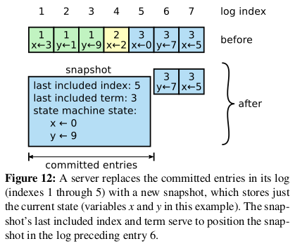
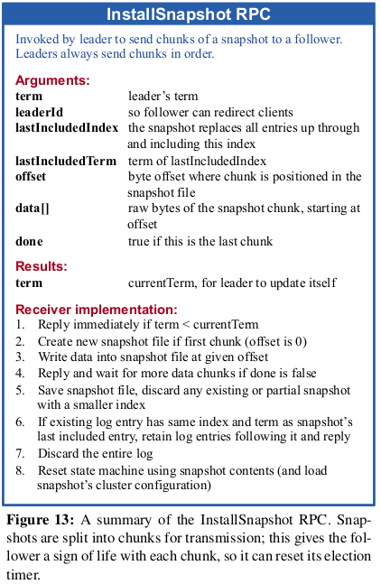

# mit6-824
mit6.824学习笔记及源码

## lab
* lab1: MapReduce  
* lab2: Raft for fault tolerant  
* lab3: K/V server base Raft  
* lab4: Sharded key value service sharding  

### 系统设计的目标
* Performance --- scalability: 扩展性  
* Fault Tolerance --- Availability: 可用性  
* Fault Tolerance --- Recoverability: 可恢复性  
### 一个常见的话题
* Consistency: 一致性  

### MapReduce  
* 大规模数据集（大于1TB）的并行运算

## Lab1: MapReduce
lab1 的主要目的是实现并行计算框架 MapReduce, master 进程负责统筹 `map/reduce` 任务的执行。  
### Worker
worker 的逻辑比较简单, 循环向 master 获取任务, 任务类型有如下三种：  
* `休眠任务`(**NO_TASK**): 由于有些 map 任务已经被分发完，但还没有到 reduce 任务, 需要休眠一定的时间再请求任务(失败的 map 任务或 reduce任务 或 失败的 reduce 任务)  
* `map任务`(**MAP_TASK**): map 任务即调用 `mapf` function 对文件中的内容做 key-value 的映射, 根据 key 做 hash(key) 映射到不同的目标 region, 把结果保存到不同的中间文件, 如 `mr-X-Y`, X 是文件id, Y 是 hash(key) 后的 id, 该步骤后, 把一个文件中的 key-value 通过 hash(key) 分到了不同的 region.  
* `reduce任务`(**REDUCE_TASK**): reduce 任务即调用 `reducef` function 对相同的 Y 结尾的文件执行 reduce, 并写到结果文件, 这样就有了 Y 个结果文件, 最后统计这 Y 个文件的内容即可获得结果。  
* **由于map任务有可能会 crash, 所以在写到中间文件时, 以临时文件的形式, 在写完后再通过 Rename 原子操作重命名**   

任务结束后需要向master请求任务完成rpc, 让 master 整理下一步。  
```Go
func Worker(mapf func(string, string) []KeyValue,
	reducef func(string, []string) string) {

	// Your worker implementation here.

	// uncomment to send the Example RPC to the master.
	// CallExample()
	for {
		// 循环工作
		err := DoWork(mapf, reducef)
		if err != nil {
			// 任务完成或连接断开时结束程序
			// 注意写文件或读文件错误时这里的 err == nil, 不会结束程序, 只会向 master 报告任务失败
			// fmt.Println(err)
			return
		}
	}
}

func DoWork(mapf func(string, string) []KeyValue,
	reducef func(string, []string) string) error {
	// 获取任务
	task := &TaskResponse{}
	err := callFuncWithName("Master.GetTask", &TaskRequest{}, task)
	if err != nil {
		return err
	}
	// fmt.Printf("recv task:%v\n", task.Tasks[0])
	// 执行任务
	finishStatus := &FinishedRequest{
		FinishedType: SLEEP_TASK,
		Tasks:        make([]*FinishTask, 0),
	}
	switch task.TaskType {
	case NO_TASK:
		// 暂时没有任务休眠
		time.Sleep(task.TimeSleep)
		// 任务完成
		finishStatus.FinishedType = SLEEP_TASK
	case MAP_TASK:
		// 执行 map 函数
		finishTasks, err := doMap(mapf, task.Tasks, task.NReduce)
		if err != nil {
			// 任务失败
			finishStatus.FinishedType = MAP_TASK_FAIL
		} else {
			// 任务完成
			finishStatus.FinishedType = MAP_TASK
		}
		finishStatus.Tasks = finishTasks
	case REDUCE_TASK:
		// 执行 reduce 函数
		finishTasks, err := doReduce(reducef, task.Tasks)
		if err != nil {
			// 任务失败
			finishStatus.FinishedType = REDUCE_TASK_FAIL
		} else {
			// 任务完成
			finishStatus.FinishedType = REDUCE_TASK
		}
		finishStatus.Tasks = finishTasks
	}

	// 反馈任务
	finishResponse := &FinishedResponse{}
	err = callFuncWithName("Master.TaskFinished", finishStatus, finishResponse)
	if err != nil {
		return err
	}
	if finishResponse.CanExit {
		// 任务已全部完成, 可以结束程序
		return errors.New("All task done!")
	}

	return nil
}
```
### Master 
master 负责分发任务, 并且注意当任务在规定时间内不能完成时, 需要重新恢复任务.
### lock-base
实现细节基于锁实现, 没有使用通道.
### 注意点
* 坑1: RPC 消息结构体有两个 string 对象时，只有一个 string 能正常传输
* 坑2: linux sort 命令排序规则基于 locale, `export LC_ALL=C` 可以解决
* 坑3: 局部作用域定义覆盖问题
```Golang
ok := false
for _, task := range tasks {
  // 这样会在内作用域重定义一个 ok, 使得外部 ok 永远为 false
	// _, ok := m.mapTask[task.FileName] 
	_, ok = m.mapTask[task.FileName]
	if ok {
		break
	}
}
if ok {
	// 任务中的文件还存在, 任务已经失败
	for _, task := range tasks {
		m.mapTask[task.FileName] = task.TaskId // 待分发
	}
}
```
## LAB2 主体逻辑(Figure 2)

## Lab2A: Leader Election And HeartBeat
选择leader  
* 状态转化逻辑  

* 实现逻辑及接口  

### Lab2A 总结
* 一个currentTerm只能voteFor其他节点1次, 在收到心跳后需要重置 voteFor 为 -1
* 注意candidates超时选举的时间随机性, 否则不好形成多数派
* 注意requestVote得到大多数投票后要立即结束等待剩余RPC
* 注意成为leader后尽快appendEntries心跳，否则其他节点又会成为candidates
* 注意几个刷新选举超时时间的逻辑点


## Lab2B: Log Replication  
日志复制与同步
### Lab2B 主要难点
* leader 需要维护每个follower的 nextIndexs(用于确定把哪些日志发送给follower) 和 matchIndexs(用于确定哪些日志可以被提交**commit**)  
* 日志条目(LogEntry)结构体的定义如下, 需要额外添加`CommandIndex`和`IsInternalLog`来确定是来自外部的log还是leader在任期开始时提交的`no-op`的空白log。 而正是因为有`no-op`日志会使得`LogIndex`相对于外部日志来说不是连续的，所以要增加一个`CommandIndex`来确保外部日志的index连续性。另一方面在设计时 logs[0] 始终是哨兵日志。以确保index和数组下标相同。
* 应用层通过 `Start(command)` 函数与raft进行交互, `Start` 在 leader 生效, 并且添加一个 log 到 logs, 返回该 log 的 `index` 和 `term` , 应用层需要接收 `applyCh` 中的 `ApplyMsg` 来确定哪些操作已经被提交了。
* 另一方面为了保证**同一个index的日志不能被提交两次**, leader **只能提交当前任期下的 log** , 从而间接提交上一个任期的 log. 如图所示是为什么只能提交当前任期的 log.  
  
  
  

### Lab2B 总结
* `nextIndexs`是`leader`对`follower`日志同步进度的猜测，`matchIndex`则是实际获知到的同步进度，leader需要不断的appendEntries来和follower进行反复校对，直到`PrevLogIndex`、`PrevLogTerm`符合Raft约束。
* Leader更新`commitIndex`需要计算大多数节点拥有的日志范围，就是大多数节点都拥有的日志范围，将其设置为commitIndex。**注意只能提交本任期内的日志**  
* Follower收到appendEntries时，一定要在处理完log写入后再更新commitIndex，因为论文中要求Follower的commitIndex是min(local log index，leaderCommitIndex)。  
* requestVote接收端，一定要严格根据论文判定发起方的lastLogIndex和lastLogTerm是否符合日志新旧条件，这里很容易写错。
* appendEntries接收端，一定要严格遵从prevLogIndex和prevLogTerm的论文校验逻辑，首先看一下prevLogIndex处是否有本地日志（prevLogIndex==0除外，相当于从头同步日志），没有的话则还需要leader来继续回退nextIndex直到prevLogIndex位置有日志。在prevLogIndex有日志的前提下，还需要进一步判断prevLogIndex位置的Term是否一样。
* 添加 `no-op` 空白日志, 隐式提交上一个任期的日志.


## Lab2C: State Persistent  
当`currentTerm、voteFor、log[]`更新后，调用persist将它们持久化下来，因为这3个状态是要求持久化的。
#### 加速备份(优化 nextIndexs)的探索  
增加三个参数回复leader定位相同的起始点  
  
```Go
// AppendEntries 请求参数
type AppendEntriesArgs struct {
	// TODO: 可以增加 msgType 表示该消息的类型(heartbeat, add log entries)

	LeaderTerm   int        // leader 的当前任期
	LeaderId     int        // leader 的 id
	PrevLogIndex int        // 新日志条目的前一个日志条目的 index
	PrevLogTerm  int        // 新日志条目的前一个日志条目的 term
	Entries      []LogEntry // 要保存的日志条目, 如果是 heartbeat , 长度为 0
	LeaderCommit int        // leader 的 commitIndex
}

// AppendEntries 响应参数
type AppendEntriesReply struct {
	FollowerTerm int  // follower 的当前 term , leader 按需要更新
	Success      bool // true 如果 follower 包含相匹配的 PrevLogIndex 和 PrevLogTerm

	// 增加三个字段用于崩溃快速恢复

	Xterm  int // 发生冲突的 term (prevLogIndex 存在时非0)
	Xindex int // Xterm 下的第一个 entry 的索引 (prevLogIndex 存在时非-1)
	Xlen   int // 日志长度 (prevLogIndex 存在时非0)
}
```
### Lab2C总结
* lab2C只是在lab2B基础上，把持久化状态进行了persist存储，另外对日志同步性能提出了更高要求，因为它会制造网络分区形成2个leader然后向2个leader同时写入大量日志，造成2个很长的歧义日志，然而默认的论文实现每次回退1个下标进行重试是无法通过单测的.  
* 仔细检查**当持久化变量发生变化的时候，在别的服务器感知之前就要做持久化**, 主要在以下几个点: (a) `start` 执行命令时; (b) `follower/candicates/leader` 转换时; (c) 在 `rpc hander` 改变状态时.  

## Lab3A: Key/value Service Without Log Compaction
### Lab3A简介
使用 Lab2 中的 Raft 库构建容错 kv 存储服务。您的 kv 服务将是一个复制状态机，由多个使用 Raft 进行复制的 kv 服务器组成。 只要大多数服务器处于活动状态并且可以通信，无论存在其他故障或网络分区，您的 kv 服务都应该继续处理客户端请求。  
**线性一致性的定义**：  
* 对于单个 client 来说，发起 OP1 必须等待其结果返回，才能执行 OP2 ，必须是顺序的（上锁或者排队提交）。
* 多个client可以并发请求。
* 一旦有1个client读取到新值，那么后续任意client的读操作都应该返回新值。  
### Client 客户端
* 客户端提供 `Put(key, value)`、`Append(key, value)` 和 `Get(key)` 三种接口, 每个客户端都通过 Clerk 使用 Put/Append/Get 方法与服务端进行通信. 由于要`保证强一致性`, 即任何一次读都能读到某个数据的最近一次写的数据. 因此接口可以设计为阻塞的形式, 并`设置超时循环调用`.   
* 另一方面为了保证操作的幂等性, 需要为每个 client 的操作提供一个独一无二的序号, 使用 `clientId + seqID` 实现.  
* 因为 leader 会由于重新选举发生变化, 所以在rpc被拒绝时应`切换到下一个 server` 作为 leader.  
```Go
type Clerk struct {
	servers []*labrpc.ClientEnd
	// You will have to modify this struct.

	mu sync.Mutex

	leaderIndex int // 上一次的 leader 索引

	clientId int64 // 唯一的 client id
	seqId    int64 // 发送的操作序列号
}
// 其中一个接口实现
func (ck *Clerk) PutAppend(key string, value string, op string) {
	// You will have to modify this function.

	args := PutAppendArgs{
		Key:      key,
		Value:    value,
		Op:       op,
		ClientId: ck.clientId,
		SeqId:    atomic.AddInt64(&ck.seqId, 1), // 原子递增序列号
	}

	for {
		reply := PutAppendReply{}
		// 先尝试上一次的 leader
		DPrintf("client[%d] start PutAppend key[%s]-value[%s] to server[%d], seq[%d]", ck.clientId, key, value, ck.currentLeader(), args.SeqId)
		timeOut, ok := ck.sendPutAppendWithTimeOut(ck.currentLeader(), &args, &reply, 3000*time.Millisecond)

		if timeOut {
			// 超时
			DPrintf("timeout")
			continue
		} else {
			if ok {
				// 收到响应
				switch reply.Err {
				case OK:
					return
				case ErrWrongLeader:
					// 切换 leader
					DPrintf("client[%d] PutAppend key err:%s", ck.clientId, reply.Err)
					ck.changeLeader()
				default:
					DPrintf("unknow err")
				}
			} else {
				// 切换 leader
				ck.changeLeader()
			}
		}
		time.Sleep(100 * time.Millisecond)
	}

}
```
### Server 服务端
* 每个 kv 服务器（“kvservers”）都会有一个关联的 Raft peer 节点。 client 将 Put()、Append() 和 Get() RPC 发送到关联 Raft 为领导者的 kvserver。   
* kvserver代码将 Put/Append/Get 操作提交给 Raft, 以便 Raft 日志保存Put/Append/Get操作的序列。 所有kvserver按顺序执行Raft日志中的操作，将操作应用到它们的键/值数据库； 目的是让服务器维护键/值数据库的相同副本。  
```Go
// 循环接收 applyCh 的消息
func (kv *KVServer) applyMsgLoop() {
	for !kv.killed() {
		msg := <-kv.applyCh
		cmd := msg.Command
		cmdIndex := msg.CommandIndex

		kv.mu.Lock()

		// 类型转换为操作日志
		op := cmd.(*Op)

		opCtx, existOp := kv.cmdMap[cmdIndex]
		prevSeq, existSeq := kv.seqMap[op.ClientId]
		kv.seqMap[op.ClientId] = op.SeqId // 接收到 msg, 说明已被提交, 更新 client 最新被提交的操作

		if existOp {
			// 存在在等待结果的 rpc, 判断状态是否与写入的时候一致
			// 如果不一致, 说明 leader 被更换了, 该 server 不再是 leader 了
			if op.Term != opCtx.op.Term {
				opCtx.wrongLeader = true
			}
		}

		// 如果是写请求, 应用状态机
		if op.Type == OP_TYPE_PUT || op.Type == OP_TYPE_APPEND {
			if !existSeq || op.SeqId > prevSeq {
				// 序列号比之前的更新, 接收这个变更
				if op.Type == OP_TYPE_PUT {
					kv.kvStore[op.Key] = op.Value
				} else if op.Type == OP_TYPE_APPEND {
					if val, ok := kv.kvStore[op.Key]; ok {
						// 已存在的 append
						kv.kvStore[op.Key] = val + op.Value
					} else {
						// 不存在的 put
						kv.kvStore[op.Key] = op.Value
					}
				}
			} else if existOp {
				// op.SeqId < prevSeq
				// 序列号落后, 该操作被忽略
				opCtx.ignored = true
			}
		} else {
			// 读请求
			if existOp {
				// 如果是 wrong
				opCtx.value, opCtx.keyExist = kv.kvStore[op.Key]
			}
		}

		DPrintf("raft node[%d] applyMsgLoop kvStore[%v]", kv.me, kv.kvStore)

		// 唤醒阻塞的 rpc
		if existOp {
			// 这里发送可能会没有线程接收(因为超时退出了)
			// opCtx.commitedChan <- 1
			// 使用 close
			close(opCtx.commitedChan)
		}

		kv.mu.Unlock()
	}
}
```
* 如果 kvserver 不属于多数派的 leader, 则不应完成 Get() RPC（以便它不提供陈旧数据）. 一个简单的解决方案是`在 Raft 日志中记录每个 Get()`（从而确保达到多数派都有读取的 key 副本）。
* 调用 Start() 后, kvserver 需要等待 Raft 达成一致性协议. 达成共识的命令到达 applyCh。根据 rpc 的上下文对被提交的状态应用到状态机, 并唤醒阻塞中的 rpc. 同时 rpc 需要设置唤醒超时, 防止没有收到唤醒时被阻塞.
```Go
// 循环接收 applyCh 的消息
func (kv *KVServer) applyMsgLoop() {
	for !kv.killed() {
		msg := <-kv.applyCh
		cmd := msg.Command
		cmdIndex := msg.CommandIndex

		kv.mu.Lock()

		// 类型转换为操作日志
		op := cmd.(*Op)

		opCtx, existOp := kv.cmdMap[cmdIndex]
		prevSeq, existSeq := kv.seqMap[op.ClientId]
		kv.seqMap[op.ClientId] = op.SeqId // 接收到 msg, 说明已被提交, 更新 client 最新被提交的操作

		if existOp {
			// 存在在等待结果的 rpc, 判断状态是否与写入的时候一致
			// 如果不一致, 说明 leader 被更换了, 该 server 不再是 leader 了
			if op.Term != opCtx.op.Term {
				opCtx.wrongLeader = true
			}
		}

		// 如果是写请求, 应用状态机
		if op.Type == OP_TYPE_PUT || op.Type == OP_TYPE_APPEND {
			if !existSeq || op.SeqId > prevSeq {
				// 序列号比之前的更新, 接收这个变更
				if op.Type == OP_TYPE_PUT {
					kv.kvStore[op.Key] = op.Value
				} else if op.Type == OP_TYPE_APPEND {
					if val, ok := kv.kvStore[op.Key]; ok {
						// 已存在的 append
						kv.kvStore[op.Key] = val + op.Value
					} else {
						// 不存在的 put
						kv.kvStore[op.Key] = op.Value
					}
				}
			} else if existOp {
				// op.SeqId < prevSeq
				// 序列号落后, 该操作被忽略
				opCtx.ignored = true
			}
		} else {
			// 读请求
			if existOp {
				// 如果是 wrong
				opCtx.value, opCtx.keyExist = kv.kvStore[op.Key]
			}
		}

		DPrintf("raft node[%d] applyMsgLoop kvStore[%v]", kv.me, kv.kvStore)

		// 唤醒阻塞的 rpc
		if existOp {
			// 这里发送可能会没有线程接收(因为超时退出了)
			// opCtx.commitedChan <- 1
			// 使用 close
			close(opCtx.commitedChan)
		}

		kv.mu.Unlock()
	}
}
```
## Lab3B: Key/value Service With Log Compaction
### Lab3B简介
随着服务器的长时间, 日志条目会不断增大, 这时保存在内存中会`使内存溢出(OOM)`, 另一方面积累了过长的日志, 由于在服务器崩溃重启后, 会重做日志中的内容, 如果日志过长会导致`重做耗时过长`. **日志压缩技术在这个 Lab 被应用**。工程上涉及 kv 层和 Raft 层的状态联动，牵扯到的代码变动范围覆盖整个 Raft 实现，因此需要极为仔细。  

#### 日志压缩技术简介  
* **快照技术 (Snapshot)** 是日志压缩最简单的方法。在快照技术中，某个时间点下的前整个系统的状态都会以快照的形式持久化起来，然后该时间点之前的日志会被全部丢弃。快照技术被使用在 Chubby 和 ZooKeeper 中，当然 Raft 中也使用快照技术。  
* **增量压缩方法(Incremental approach to compaction)**，例如`日志清洗(log cleaning)` 和 `日志结构合并树(log-structured merge trees)`都是可行的。这些方法每次只对一小部分数据进行操作，这样就分散了压缩的负载压力。首先，选择一个积累了大量被删除或被覆盖的对象的数据区域，然后重写该区域内还活着的对象，之后释放该区域。和快照技术相比，这需要大量额外的机制，并且增加了更多的复杂性，快照技术通过操作整个数据集来简化问题。  
### Lab3B 技术难点
* 日志压缩的时机由 kv 服务层决定, 当日志的字节大小超过一定的阈值时, 调用`TakeSnapshot(snapshot, lastIncludedIndex)`进行压缩, 并由单独的 goroutine负责。  
* 日志快照包括的内容: 
&nbsp;&nbsp;`kvStore`: key-value 状态机  
&nbsp;&nbsp;`seqMap(clientId->clientMaxSeq)`: 记录每个client客户端的当前最大请求序列号, 因为要保证客户端的请求幂等性(在重启后依然能读到快照中的各序列号), 另外有些还没压缩成快照的日志会提供快照后的所有client->seq信息, 从而保证了seqMap记录的已提交序号是最新的.  
```Go
// 循环检查是否需要 snapshot 的 goroutine
func (kv *KVServer) snapshotLoop() {
	for !kv.killed() {
		var snapshot []byte
		var lastIncludedIndex int

		// 如果日志长度超过了 maxraftstate, 则进行快照
		if kv.maxraftstate != -1 && kv.rf.ExceedLogSize(kv.maxraftstate) {
			// 进行快照时需要上锁
			kv.mu.Lock()
			w := new(bytes.Buffer)
			e := labgob.NewEncoder(w)
			e.Encode(kv.kvStore)
			e.Encode(kv.seqMap) // 当前各客户端最大请求序号, 也要进行快照, 防止 leader 宕机后马上重启安装快照丢失了各客户端的请求序号(保证幂等性)
			snapshot = w.Bytes()
			lastIncludedIndex = kv.lastAppliedIndex
			DPrintf("kvserver[%d] dump snapshot, snapshotSize[%d] lastAppliedIndex[%d]", kv.me, len(snapshot), kv.lastAppliedIndex)
			kv.mu.Unlock()
		}

		// 在释放锁后通知 raft 层截断, 否则有死锁
		if snapshot != nil {
			// 通知 raft 截断已经应用到状态机的日志(这些日志都已经提交, 可以放心操作)
			kv.rf.TakeSnapshot(snapshot, lastIncludedIndex)
		}
		time.Sleep(10 * time.Millisecond)
	}
}
```
* 使用 Snapshot 应该在kv服务层维护最近应用日志索引的 lastIncludedIndex, 以便调用 TakeSnapshot 时 raft 能够知道日志的截断位置。
* Raft 需要新增三个`持久化变量`: `lastIncludedIndex`, `lastIncludedTerm`,`lastIncludedCmdIndex`以维护最近一次快照最后一条日志的 Index.
* Raft 在日志压缩时需要丢掉已经压缩成快照的`并保留压缩的最后一条日志作为哨兵节点`, 并且释放原来的 logs 内存(不再由指针引用该slice)
```Go
// 执行快照由 kv 服务层调用, 删除掉被压缩的日志并保存快照
func (rf *Raft) TakeSnapshot(snapshot []byte, lastIncludedIndex int) {
	rf.mu.Lock()
	defer rf.mu.Unlock()

	// 此快照比最近一次快照落后, 忽略这个快照
	if lastIncludedIndex <= rf.lastIncludedIndex {
		return
	}

	DPrintf("server[%d] TakeSnapshot begins, IsLeader[%v] snapshotLastIndex[%d] lastIncludedIndex[%d] lastIncludedTerm[%d] lastIncludedCmdIndex[%d]",
		rf.me, rf.role == LEADER, lastIncludedIndex, rf.lastIncludedIndex, rf.lastIncludedTerm, rf.lastIncludedCmdIndex)

	// 更新快照元信息(最后才能更新 lastIncludedIndex)
	rf.lastIncludedTerm = rf.logs[rf.logIndex2LogPos(lastIncludedIndex)].LogTerm
	rf.lastIncludedCmdIndex = rf.logs[rf.logIndex2LogPos(lastIncludedIndex)].CommandIndex

	// 压缩日志
	afterLog := make([]LogEntry, 0)
	// 这里位置 0 保存了 lastEntry 作为哨兵节点
	afterLog = append(afterLog, rf.logs[rf.logIndex2LogPos(lastIncludedIndex):]...)
	// 位置 0 始终是哨兵节点(Command == nil)
	afterLog[0].Command = nil

	rf.logs = afterLog

	// 最后才能更新 lastIncludedIndex
	rf.lastIncludedIndex = lastIncludedIndex
	// 持久化 snapshot 和 raft state
	rf.persister.SaveStateAndSnapshot(rf.encodeRaftState(), snapshot)

	DPrintf("server[%d] TakeSnapshot end, IsLeader[%v] snapshotLastIndex[%d] lastIncludedIndex[%d] lastIncludedTerm[%d] lastIncludedCmdIndex[%d]",
		rf.me, rf.role == LEADER, lastIncludedIndex, rf.lastIncludedIndex, rf.lastIncludedTerm, rf.lastIncludedCmdIndex)
}
```
* 为了适配增加快照之后, 原来的日志被清除后, `LogIndex 与日志数组 LogPos 无法对应`, 因此需要添加以下两个接口, 适配索引位置.
```Go
func (rf *Raft) logIndex2LogPos(logIndex int) int {
	return logIndex - rf.lastIncludedIndex
}

// 获取最后一条日志
func (rf *Raft) getLastLog() LogEntry {
	return rf.logs[len(rf.logs)-1]
}
```
* Raft 的 HeartBeatToServer 除了需要执行 `AppendEntries(心跳/日志复制)`, 还要执行 `InstallSnapshot(快照复制)` 给那些过于落后的 follower 发送日志.  
```Go
// HeartBeatToServer 线程
func (rf *Raft) HeartBeatToServer(peerIndex int) {
	for !rf.killed() {
		rf.mu.Lock()
		if rf.role != LEADER {
			// 收到了 term 更大的心跳或 requestVote, 已切换为follower
			rf.mu.Unlock()
			return
		}
		flag := rf.leaderPtr.nextIndexs[peerIndex] <= rf.lastIncludedIndex
		rf.mu.Unlock()

		if flag {
			// 需要发送 InstallSnapshot
			rf.doInstallSnapshotRPC(peerIndex)
		} else {
			// 需要发送 AppendEntries
			rf.doAppendEntriesRPC(peerIndex)
		}
	}
}
```
* `InstallSnapshot RPC`: leader 发送当前的 snapshot 给 follower, 逻辑如下图所示. **特别注意在清理日志时需要保留哨兵节点, 且哨兵节点的Index需要保证正确性**.   

```Go
// InstallSnapshot 请求参数
type InstallSnapshotArgs struct {
	Term                 int    // leader 的任期
	LeaderId             int    // leader id
	LastIncludedIndex    int    // 快照的最后一个日志索引
	LastIncludedTerm     int    // 快照的最后一个日志任期
	LastIncludedCmdIndex int    // 快照的最后一个日志的 cmdIndex
	Offset               int    // 数据块偏移量
	Data                 []byte // 快照数据块
	Done                 bool   // 是否是最后一个块
}

type InstallSnapshotReply struct {
	Term int // follower 当前的任期, 供 leader 更新
}

// doInstallSnapshotRPC 的逻辑
func (rf *Raft) doInstallSnapshotRPC(peerIndex int) {
	rf.mu.Lock()
	DPrintf("server %d doInstallSnapshotRPC starts, to peerId[%d]", rf.me, peerIndex)

	args := &InstallSnapshotArgs{
		Term:                 rf.currentTerm,
		LeaderId:             rf.me,
		LastIncludedIndex:    rf.lastIncludedIndex,
		LastIncludedTerm:     rf.lastIncludedTerm,
		LastIncludedCmdIndex: rf.lastIncludedCmdIndex,
		Offset:               0,
		Data:                 rf.persister.ReadSnapshot(),
		Done:                 true,
	}
	rf.mu.Unlock()
	reply := &InstallSnapshotReply{}

	// 请求时不要持有锁
	timeOut, ok := rf.sendInstallSnapshotWithTimeOut(peerIndex, args, reply, 50*time.Millisecond)

	if timeOut {
		// 任务超时
		time.Sleep(10 * time.Millisecond)
		return // 10ms 后重试
	} else if ok {
		// 收到响应
		rf.mu.Lock()
		if rf.currentTerm != args.Term {
			rf.mu.Unlock()
			return // leader 被弃用
		}

		if reply.Term > rf.currentTerm {
			// 发现更高的 term, 成为 follower
			rf.becomeFollower(reply.Term)
			rf.mu.Unlock()
			return
		} else {
			// 成功接收
			rf.leaderPtr.nextIndexs[peerIndex] = args.LastIncludedIndex + 1 // 定位到已应用的下一个 index
			rf.leaderPtr.matchIndexs[peerIndex] = args.LastIncludedIndex
			// 不用尝试更新 commitIndex, 因为只有已经应用到 kv 服务层的日志才会被压缩, 这些日志都是已经被提交了的
			rf.mu.Unlock()
			// 成功接收不要 sleep, 为了后面的log能尽快达成共识
			// time.Sleep(100 * time.Millisecond)
		}
	} else {
		// 没有收到响应, 10ms 后重试
		time.Sleep(10 * time.Millisecond)
	}
}

// InstallSnapshot rpc handler
func (rf *Raft) InstallSnapshot(args *InstallSnapshotArgs, reply *InstallSnapshotReply) {
	rf.mu.Lock()
	defer rf.mu.Unlock()

	reply.Term = rf.currentTerm

	// follower 的 term 更大, 拒绝请求
	if args.Term < rf.currentTerm {
		return
	}

	// leader 的任期更大, 成为 follower
	if args.Term > rf.currentTerm {
		rf.becomeFollower(args.Term)
	}

	if args.LastIncludedIndex <= rf.lastIncludedIndex {
		// 此次快照落后, 忽略它
		return
	} else {
		// leader 快照比本地快照长

		// 快照外还有日志, 判断是否需要保留
		if args.LastIncludedIndex < rf.getLastLog().LogIndex {
			if rf.logs[rf.logIndex2LogPos(args.LastIncludedIndex)].LogTerm != args.LastIncludedTerm {
				// 日志存在冲突, 扔掉快照外的所有日志, 释放内存
				rf.logs = make([]LogEntry, 0)
				// 注意添加哨兵节点
				rf.logs = append(rf.logs, LogEntry{
					LogTerm:       args.LastIncludedTerm,
					LogIndex:      args.LastIncludedIndex,
					Command:       nil,
					CommandIndex:  args.LastIncludedCmdIndex,
					IsInternalLog: true,
				})
			} else {
				// 不冲突, 保留后续日志(注意保留哨兵节点)
				afterLog := make([]LogEntry, rf.getLastLog().LogIndex-args.LastIncludedIndex+1)
				copy(afterLog, rf.logs[rf.logIndex2LogPos(args.LastIncludedIndex):])
				rf.logs = afterLog
				rf.logs[0].IsInternalLog = true
				rf.logs[0].Command = nil
			}
		} else {
			// 快照比本地日志长, 直接全部清空, 注意保留哨兵节点
			rf.logs = make([]LogEntry, 0)
			// 注意添加哨兵节点
			rf.logs = append(rf.logs, LogEntry{
				LogTerm:       args.LastIncludedTerm,
				LogIndex:      args.LastIncludedIndex,
				Command:       nil,
				CommandIndex:  args.LastIncludedCmdIndex,
				IsInternalLog: true,
			})
		}
	}

	// 更新快照元数据
	rf.lastIncludedIndex = args.LastIncludedIndex
	rf.lastIncludedTerm = args.LastIncludedTerm
	rf.lastIncludedCmdIndex = args.LastIncludedCmdIndex

	// 持久化状态和快照
	rf.persister.SaveStateAndSnapshot(rf.encodeRaftState(), args.Data)
	// 提交到 kv 层
	rf.installSnapshotToApplication()
}
```
* follower 接收到快照后需要把快照应用到 kv 层, 因此, applyMsg 需要增加快照字段
```Go
type ApplyMsg struct {
	CommandValid bool // True 表示是日志条目, False 表示是 日志快照
	Command      interface{}
	CommandIndex int
	LogIndex     int

	// 快照相关变量
	Snapshot             []byte
	LastIncludedIndex    int
	LastIncludedTerm     int
	LastIncludedCmdIndex int
}

// 把快照应用到 kv 层
func (rf *Raft) installSnapshotToApplication() {
	applyMsg := ApplyMsg{
		CommandValid:         false,
		Snapshot:             rf.persister.ReadSnapshot(),
		LastIncludedIndex:    rf.lastIncludedIndex,    // 首次是 从持久化状态读取的快照的最后一个log index
		LastIncludedTerm:     rf.lastIncludedTerm,     // 首次是 从持久化状态读取的快照的最后一个log term
		LastIncludedCmdIndex: rf.lastIncludedCmdIndex, // 首次是 从持久化状态读取的快照的最后一个log cmdIndex
	}

	rf.lastApplied = rf.lastIncludedIndex
	rf.commitIndex = rf.lastIncludedIndex

	DPrintf("server %d installSnapshotToApplication, SnapshotSize[%d], lastIncludedIndex[%d], lastIncludedTerm[%d]",
		rf.me, len(applyMsg.Snapshot), applyMsg.LastIncludedIndex, applyMsg.LastIncludedTerm)

	rf.applyChan <- applyMsg
}
```
* 最后在 kv 层的 applyChLoop 需要增加接收 applyMsg 为快照时的逻辑, 同时更新 `lastIncludedIndex`
```Go
// 循环接收 applyCh 的消息 goroutine
func (kv *KVServer) applyMsgLoop() {
	for !kv.killed() {
		msg := <-kv.applyCh
		if msg.CommandValid {
			// 普通日志 log
			cmd := msg.Command
			cmdIndex := msg.CommandIndex

			kv.mu.Lock()

			if msg.LogIndex <= kv.lastAppliedIndex {
				// 落后的 applymsg
				kv.mu.Unlock()
				continue
			}

			// 更新已经应用到的 logIndex
			kv.lastAppliedIndex = msg.LogIndex
			// 类型转换为操作日志
			op := cmd.(*Op)

			opCtx, existOp := kv.cmdMap[cmdIndex]
			prevSeq, existSeq := kv.seqMap[op.ClientId]
			kv.seqMap[op.ClientId] = op.SeqId // 接收到 msg, 说明已被提交, 更新 client 最新被提交的操作

			if existOp {
				// 存在在等待结果的 rpc, 判断状态是否与写入的时候一致
				// 如果不一致, 说明 leader 被更换了, 该 server 不再是 leader 了
				if op.Term != opCtx.op.Term {
					opCtx.wrongLeader = true
				}
			}

			// 如果是写请求, 应用状态机
			if op.Type == OP_TYPE_PUT || op.Type == OP_TYPE_APPEND {
				if !existSeq || op.SeqId > prevSeq {
					// 序列号比之前的更新, 接收这个变更
					if op.Type == OP_TYPE_PUT {
						kv.kvStore[op.Key] = op.Value
					} else if op.Type == OP_TYPE_APPEND {
						if val, ok := kv.kvStore[op.Key]; ok {
							// 已存在的 append
							kv.kvStore[op.Key] = val + op.Value
						} else {
							// 不存在的 put
							kv.kvStore[op.Key] = op.Value
						}
					}
				} else if existOp {
					// op.SeqId < prevSeq
					// 序列号落后, 该操作被忽略
					opCtx.ignored = true
				}
			} else {
				// 读请求
				if existOp {
					// 如果是 wrongleader, 这个结果也不会被读到
					opCtx.value, opCtx.keyExist = kv.kvStore[op.Key]
				}
			}

			DPrintf("raft node[%d] applyMsgLoop kvStore[%v]", kv.me, kv.kvStore)

			// 唤醒阻塞的 rpc
			if existOp {
				// 这里发送可能会没有线程接收(因为超时退出了)
				// opCtx.commitedChan <- 1
				// 使用 close
				close(opCtx.commitedChan)
			}

			kv.mu.Unlock()
		} else {
			// 安装快照
			kv.mu.Lock()
			if msg.LastIncludedIndex <= kv.lastAppliedIndex {
				// 落后的 applymsg
				kv.mu.Unlock()
				continue
			}

			// 更新已经应用到的 logIndex
			kv.lastAppliedIndex = msg.LastIncludedIndex

			if len(msg.Snapshot) == 0 {
				// 空快照, 清空数据
				kv.kvStore = make(map[string]string)
				kv.seqMap = make(map[int64]int64)
			} else {
				// 把快照反序列化, 安装到内存
				r := bytes.NewBuffer(msg.Snapshot)
				d := labgob.NewDecoder(r)
				d.Decode(&kv.kvStore)
				d.Decode(&kv.seqMap)
				// 这里不用担心 seqMap 的 client.seq 不够新, 后续随着 log 条目的更新, 会更新 client.seq
				// 之所以快照要压缩 kv.seqMap, 是防止有些 client.seq 在后续的 log 条目上没有更新.
			}
			kv.mu.Unlock()
		}
	}
}
```

### Lab3B 总结
* Lab3B增加日志压缩之后, 涉及到 `doAppendEntriesRPC`, `AppendEntries`, `Start`等已经实现的方法存在下标不对应问题, 需要重新整理逻辑兼容 snapshot 带来的下标问题.
* 增加了快照最后一条日志的 `LogIndex`, `Term`, `CmdIndex`作为持久化变量, 保证日志复制的正确性.
* 增加了 `InstallSnapshot` RPC 发送日志快照.
* 待优化的点在 doAppendEntries: `优化心跳和发送日志, 可以以 100ms 定时器为 case1, start(cmd) 新增日志发送提醒channel为 case2, 加快达成共识的速度`. 从而增大服务层的 QPS, 因为强一致性系统的 QPS 取决于达成共识的速度, 在通信正常的情况下, 假设来回通信时间是 10ms, 那么理想的 QPS 约为 100.  