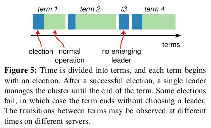
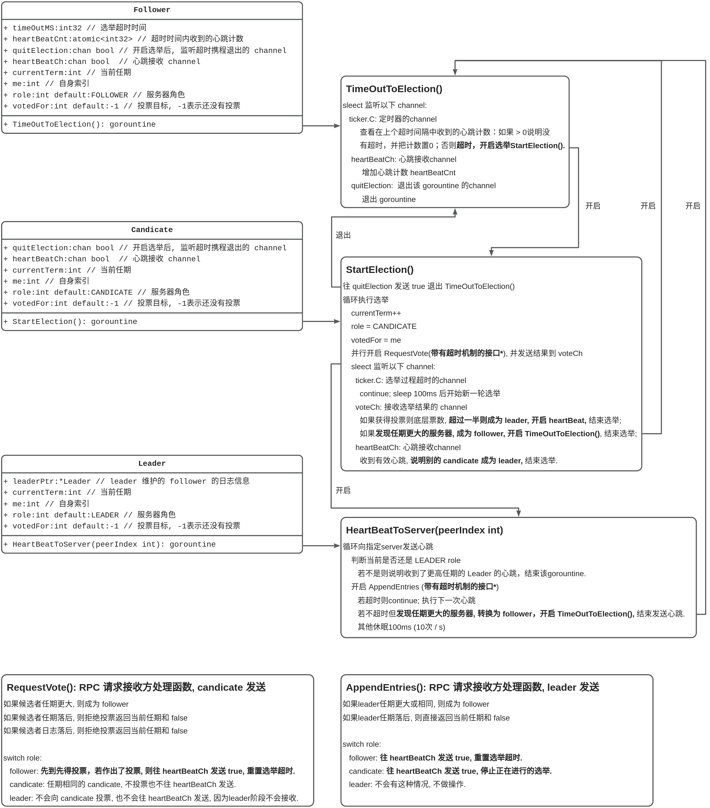
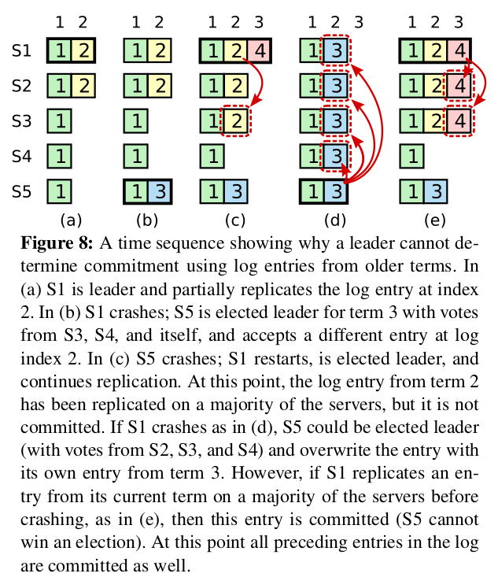
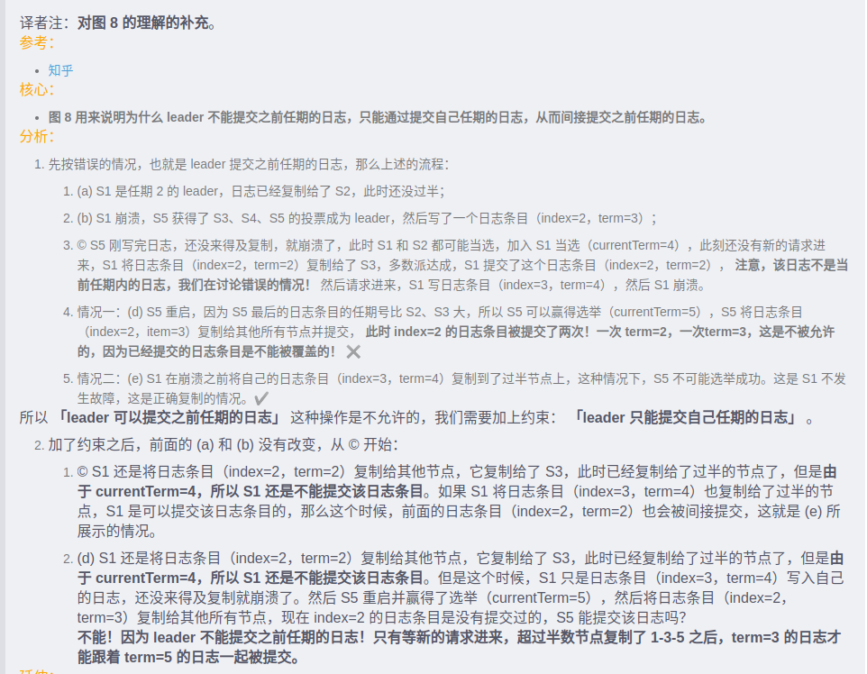
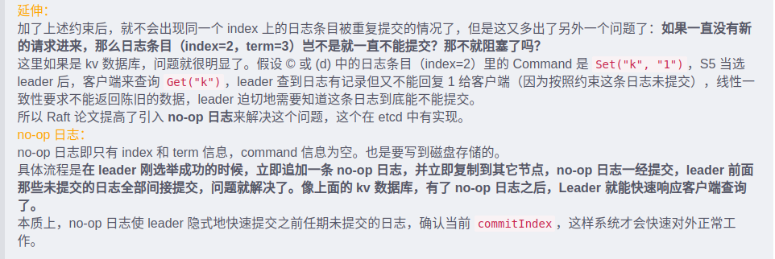

# mit6-824
mit6.824学习笔记及源码

### lab
* lab1: MapReduce  
* lab2: Raft for fault tolerant  
* lab3: K/V server base Raft  
* lab4: Sharded key value service sharding  

#### 系统设计的目标
* Performance --- scalability: 扩展性  
* Fault Tolerance --- Availability: 可用性  
* Fault Tolerance --- Recoverability: 可恢复性  
#### 一个常见的话题
* Consistency: 一致性  

#### MapReduce  
* 大规模数据集（大于1TB）的并行运算

### Lab1: MapReduce
* 坑1: RPC 消息结构体有两个 string 对象时，只有一个 string 能正常传输
* 坑2: linux sort 命令排序规则基于 locale, `export LC_ALL=C` 可以解决
* 坑3: 局部作用域定义覆盖问题
```Golang
ok := false
for _, task := range tasks {
  // 这样会在内作用域重定义一个 ok, 使得外部 ok 永远为 false
	// _, ok := m.mapTask[task.FileName] 
	_, ok = m.mapTask[task.FileName]
	if ok {
		break
	}
}
if ok {
	// 任务中的文件还存在, 任务已经失败
	for _, task := range tasks {
		m.mapTask[task.FileName] = task.TaskId // 待分发
	}
}
```

### Lab2A: Leader Election And HeartBeat
* 状态转化逻辑  

* 实现逻辑及接口  


### Lab2B: Log Replication  
#### Lab2B 主要难点
* leader 需要维护每个follower的 nextIndexs(用于确定把哪些日志发送给follower) 和 matchIndexs(用于确定哪些日志可以被提交**commit**)  
* 日志条目(LogEntry)结构体的定义如下, 需要额外添加`CommandIndex`和`IsInternalLog`来确定是来自外部的log还是leader在任期开始时提交的`no-op`的空白log。 而正是因为有`no-op`日志会使得`LogIndex`相对于外部日志来说不是连续的，所以要增加一个`CommandIndex`来确保外部日志的index连续性。另一方面在设计时 logs[0] 始终是哨兵日志。以确保index和数组下标相同。
* 应用层通过 `Start(command)` 函数与raft进行交互, `Start` 在 leader 生效, 并且添加一个 log 到 logs, 返回该 log 的 `index` 和 `term` , 应用层需要接收 `applyCh` 中的 `ApplyMsg` 来确定哪些操作已经被提交了。
* 另一方面为了保证**同一个index的日志不能被提交两次**, leader **只能提交当前任期下的 log** , 从而间接提交上一个任期的 log. 如图所示是为什么只能提交当前任期的 log.  
  
  
  
