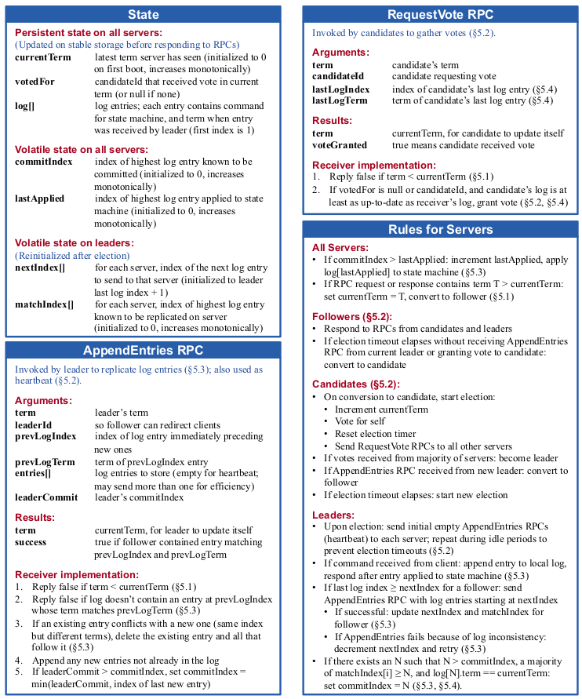
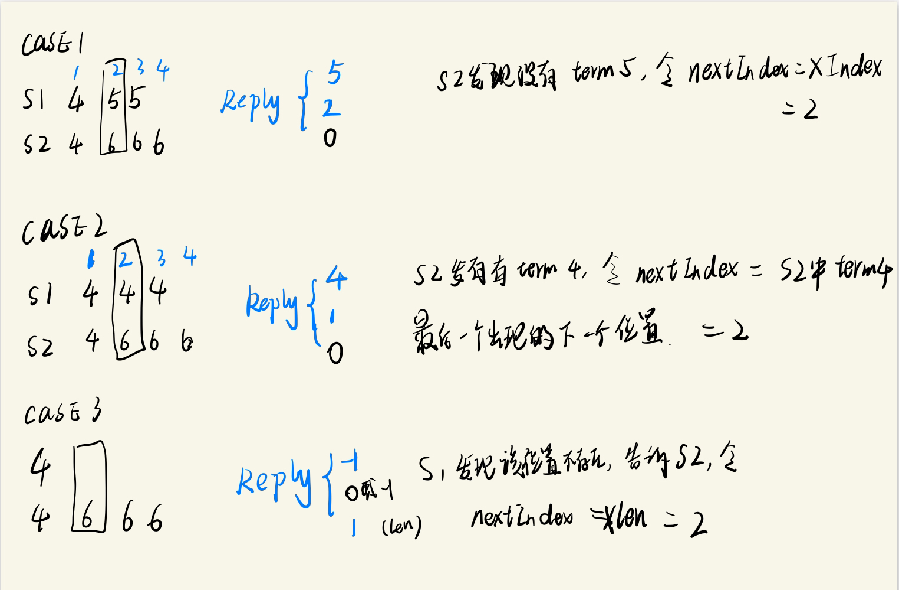

- [LAB2 主体逻辑(Figure 2)](#lab2-主体逻辑figure-2)
- [Lab2A: Leader Election And HeartBeat](#lab2a-leader-election-and-heartbeat)
  - [leader选举](#leader选举)
  - [Lab2A 总结](#lab2a-总结)
- [Lab2B: Log Replication](#lab2b-log-replication)
  - [Lab2B 主要难点](#lab2b-主要难点)
  - [Lab2B 总结](#lab2b-总结)
- [Lab2C: State Persistent](#lab2c-state-persistent)
  - [加速备份(优化 nextIndexs)的探索](#加速备份优化-nextindexs的探索)
  - [Lab2C总结](#lab2c总结)

## LAB2 主体逻辑(Figure 2)


## Lab2A: Leader Election And HeartBeat
### leader选举  
* 状态转化逻辑  

* 实现逻辑及接口  

### Lab2A 总结
* 一个currentTerm只能voteFor其他节点1次, 在收到心跳后需要重置 voteFor 为 -1
* 注意candidates超时选举的时间随机性, 否则不好形成多数派
* 注意requestVote得到大多数投票后要立即结束等待剩余RPC
* 注意成为leader后尽快appendEntries心跳，否则其他节点又会成为candidates
* 注意几个刷新选举超时时间的逻辑点


## Lab2B: Log Replication  
日志复制与同步
### Lab2B 主要难点
* leader 需要维护每个follower的 nextIndexs(用于确定把哪些日志发送给follower) 和 matchIndexs(用于确定哪些日志可以被提交**commit**)  
* 日志条目(LogEntry)结构体的定义如下, 需要额外添加`CommandIndex`和`IsInternalLog`来确定是来自外部的log还是leader在任期开始时提交的`no-op`的空白log。 而正是因为有`no-op`日志会使得`LogIndex`相对于外部日志来说不是连续的，所以要增加一个`CommandIndex`来确保外部日志的index连续性。另一方面在设计时 logs[0] 始终是哨兵日志。以确保index和数组下标相同。
* 应用层通过 `Start(command)` 函数与raft进行交互, `Start` 在 leader 生效, 并且添加一个 log 到 logs, 返回该 log 的 `index` 和 `term` , 应用层需要接收 `applyCh` 中的 `ApplyMsg` 来确定哪些操作已经被提交了。
* 另一方面为了保证**同一个index的日志不能被提交两次**, leader **只能提交当前任期下的 log** , 从而间接提交上一个任期的 log. 如图所示是为什么只能提交当前任期的 log.  
  
  
  

### Lab2B 总结
* `nextIndexs`是`leader`对`follower`日志同步进度的猜测，`matchIndex`则是实际获知到的同步进度，leader需要不断的appendEntries来和follower进行反复校对，直到`PrevLogIndex`、`PrevLogTerm`符合Raft约束。
* Leader更新`commitIndex`需要计算大多数节点拥有的日志范围，就是大多数节点都拥有的日志范围，将其设置为commitIndex。**注意只能提交本任期内的日志**  
* Follower收到appendEntries时，一定要在处理完log写入后再更新commitIndex，因为论文中要求Follower的commitIndex是min(local log index，leaderCommitIndex)。  
* requestVote接收端，一定要严格根据论文判定发起方的lastLogIndex和lastLogTerm是否符合日志新旧条件，这里很容易写错。
* appendEntries接收端，一定要严格遵从prevLogIndex和prevLogTerm的论文校验逻辑，首先看一下prevLogIndex处是否有本地日志（prevLogIndex==0除外，相当于从头同步日志），没有的话则还需要leader来继续回退nextIndex直到prevLogIndex位置有日志。在prevLogIndex有日志的前提下，还需要进一步判断prevLogIndex位置的Term是否一样。
* 添加 `no-op` 空白日志, 隐式提交上一个任期的日志.


## Lab2C: State Persistent  
当`currentTerm、voteFor、log[]`更新后，调用persist将它们持久化下来，因为这3个状态是要求持久化的。
### 加速备份(优化 nextIndexs)的探索  
增加三个参数回复leader定位相同的起始点  
  
```Go
// AppendEntries 请求参数
type AppendEntriesArgs struct {
	// TODO: 可以增加 msgType 表示该消息的类型(heartbeat, add log entries)

	LeaderTerm   int        // leader 的当前任期
	LeaderId     int        // leader 的 id
	PrevLogIndex int        // 新日志条目的前一个日志条目的 index
	PrevLogTerm  int        // 新日志条目的前一个日志条目的 term
	Entries      []LogEntry // 要保存的日志条目, 如果是 heartbeat , 长度为 0
	LeaderCommit int        // leader 的 commitIndex
}

// AppendEntries 响应参数
type AppendEntriesReply struct {
	FollowerTerm int  // follower 的当前 term , leader 按需要更新
	Success      bool // true 如果 follower 包含相匹配的 PrevLogIndex 和 PrevLogTerm

	// 增加三个字段用于崩溃快速恢复

	Xterm  int // 发生冲突的 term (prevLogIndex 存在时非0)
	Xindex int // Xterm 下的第一个 entry 的索引 (prevLogIndex 存在时非-1)
	Xlen   int // 日志长度 (prevLogIndex 存在时非0)
}
```
### Lab2C总结
* lab2C只是在lab2B基础上，把持久化状态进行了persist存储，另外对日志同步性能提出了更高要求，因为它会制造网络分区形成2个leader然后向2个leader同时写入大量日志，造成2个很长的歧义日志，然而默认的论文实现每次回退1个下标进行重试是无法通过单测的.  
* 仔细检查**当持久化变量发生变化的时候，在别的服务器感知之前就要做持久化**, 主要在以下几个点: (a) `start` 执行命令时; (b) `follower/candicates/leader` 转换时; (c) 在 `rpc hander` 改变状态时.  

